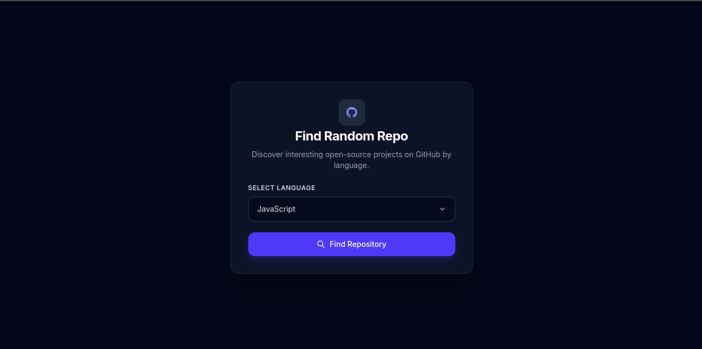

# ⚡ GitHub Random Repository Finder

A sleek, responsive, and lightweight web application built with **Vanilla JavaScript**, **HTML5**, and **Tailwind CSS**. It uses the **GitHub REST API** to search repositories based on a selected programming language and display a random repository with useful information through a clean and minimal interface.



🔗 Live Demo: [YOUR_LIVE_DEMO_URL](https://git-hub-random-repository-flame.vercel.app/)


---

## ✨ Features

* 🔍 **Language Selection**: Select a programming language to search for related GitHub repositories.
* 🎲 **Random Repository**: Selects and displays a random repository from the search results.
* ⭐ **Repository Statistics**: Displays stars, forks, and open issues.
* 📝 **Repository Description**: Shows the repository name and description.
* 🔗 **GitHub Link**: Provides direct access to the selected repository on GitHub.
* 🔄 **Refresh Repository**: Generate another random repository from the current search results.
* ⏳ **Loading State**: Displays a full-screen loading state while fetching data.
* ⚠️ **Error Handling**: Handles API and network errors gracefully.
* 📭 **Empty State**: Displays a message when no repositories are found.
* 📱 **Responsive Design**: Optimized for desktop, tablet, and mobile screens.
* ⚡ **Vanilla JavaScript**: Built without React or other JavaScript frameworks.

---

## 🛠️ Tech Stack

* **HTML5**: Semantic document structure and application layout.
* **Tailwind CSS**: Utility-first CSS framework for responsive styling.
* **Vanilla JavaScript (ES6+)**: API requests, DOM manipulation, event handling, and application logic.
* **GitHub REST API**: Repository search and repository data.

---

## 🔌 API

This project uses the **GitHub REST API** to search for repositories based on the selected programming language.

### Repository Search API

The application sends a search request using the selected language:

```text
https://api.github.com/search/repositories?q=language:javascript
```

The API response provides repository information such as:

* Repository name
* Repository description
* Stars
* Forks
* Open issues
* Repository URL

The application then selects one repository randomly from the returned results and displays it in the interface.

---

## 📁 Project Structure

```text
GitHub-Random-Repository/
├── assets/
│   ├── js/
│   │   └── app.js          # Main application logic & API handling
│   │
│   └── style/
│       ├── input.css       # Tailwind CSS source file
│       └── output.css      # Compiled CSS stylesheet
│
├── index.html              # Main HTML document
├── package.json            # Project dependencies & scripts
├── package-lock.json       # Dependency lock file
└── README.md               # Project documentation
```

---

## 🚀 How It Works

1. Select a programming language from the dropdown.
2. Submit the form to search GitHub repositories.
3. The application sends a request to the GitHub REST API.
4. The returned repositories are stored in the application state.
5. A random repository is selected from the results.
6. Repository information is displayed in the UI.
7. Use the refresh functionality to display another random repository.

---

## 📄 License

This project is licensed under the **MIT License**.
